## chapter-13

### exercise 13-1

[1] 次のコードのログA~Cが出力される順番を答えてください。

```javascript
setTimeout(() => {
    console.log("A");
}, 1000);

setTimeout(() => {
    console.log("B");
}, 0);

console.log("C");
```
C→B→A

- 非同期処理はグローバルコンテキストが全て終了してから実行される


### exercise 13-2

- 13-2.htmlに記載

### exercise 13-3

- 13-3.htmlに記載

### exercise 13-4

- 13-4.htmlに記載

### exercise 13-5

[1] Promiseのメソッドについて

- Promise.allは、すべてのPromiseがfulfilledのステータスに遷移するとthenメソッドに移行する、1つでもステータスがrejectedに遷移するとcatchメソッドが呼び出される
- Promise.raceは、いずれかのPromiseがsettledのステータスになったタイミングでthenメソッドまたはcatchメソッドを実行する
- Promise.anyは、いずれかのPromiseがfulfilledになったタイミングでthenメソッドに処理を移す、また、すべてのPromiseの状態がrejectedになったときはcatchメソッドを実行する
- Promise.allSettledはすべてのPromiseインスタンスの状態がsettledになったときにthenメソッドに処理を移行する、また、thenメソッドのコールバック関数には、それぞれのPromiseのステータんすの状態を含むオブジェクトが配列に格納されて渡される

### exercise 13-6

[1] 次のコードを実行したときにA~Eがコンソールに表示される順番を答えてください。

```javascript
console.log('A');

setTimeout(() => {
    queueMicrotask(() => console.log('B'));
    console.log('C');
});

Promise.resolve().then(() => console.log('D'));

console.log('E');
```
A→E→D→C→B

- 実行の優先度はcallstack > job queue > task queue
- setTimeoutはtask queueに、Promiseはjob queueに中身を登録する働きをしたらcallstackから消滅する
- callstackが全部空いたらイベントループがjob queueに空いたことを伝え、job queueの中身がcallstackに移動する
- job queueも空いたらtask queueの中身がcallstackに移動する (queueMicrotaskの中身はjob queueに移動する)
- Promise.resolve().then()はPromiseがfulfilledになったらthenが実行されるというオブジェクトだが、resolveの中身が何もないのでthen()が即時実行される



### exercise 13-7

- 13-7.htmlに記載

### exercise 13-8

- 13-8.htmlに記載

### 理解度チェック

[1] 非同期処理とは
- ブラウザのJavaScriptを実行するスレッドのことをメインスレッドと呼ぶ
- メインスレッドで実行されるコードはすべて同期的に処理される
- 一方、非同期処理の場合はメインスレッドから一度切り離されて、タスクキューにタスクとして追加されコールスタックが空になったタイミングをイベントループによって検知し、再びメインスレッドに戻ってきて実行される

[2] chapter-13-check.htmlに記載

[3] chapter-13-check.htmlに記載

[4] chapter-13-check.htmlに記載
